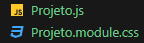

# Aprendendo React :
Esse projeto de teste serve para documentar minha evolução durante os próximos dias aprendendo sobre React.

A ideia é que este *README* seja ao mesmo tempo um log do meu progresso e um material para revisitar e ler minhas anotações.

## 14/06 - Conceitos Iniciais 📝
### O que é JSX ?
Começando a entender o que é o ***JSX*** uma forma de escrever **HTML** no **JS**.
Nos permitindo interpolar variáveis com o uso do ```{}```.

***Ex:***
```

```
Nesse contexto acima, a url da imagem pode ser dinamicamente trocada assim como o seu texto alternativo.

Desse modo podemos trabalhar de forma simultânea com ambas linguagens.

### Aprendendo sobre Components e Props
Componentes são o grande diferencial do React. Partindo do entendimento que o próprio `App.js` é um Componente, é fácil de perceber qual a sua estrutura básica.
```
// Para um arquivo Exemplo.js
function Exemplo (){
    return(
        <div>
            ...
        </div>
    )
}

export default Exemplo

```
Assim, basta fazer um `import Exemplo from './components/Exemplo'` e nós teremos acesso a tudo dentro de exemplo, podendo chamá-lo como se fosse uma tag `<Exemplo/>` .

Propriedades (ou props) são um degrau mais fundo no uso de Componentes, onde somos capazes de dar atributos personalizados para eles.

```
    function Pessoa (props){
    return(
        <>
            <p>Eu sou uma pessoa e meu nome é {props.nome}</p>
        </>
    )
}
```
Na chamada do Componente `<Pessoa/>` deveremos passar seu nome como atributo
```
<Pessoa nome="João" />
```
Também é possível passar mais de uma propriedade:
```
function Pessoa (props){
    return(
        <>
            <p>Eu sou uma pessoa e meu nome é {props.nome} e minha idade é {props.idade}</p>
        </>
    )
}
```
Ou, passando um objeto com as propriedades solicitadas
```
function Pessoa ({nome, idade}){
    return(
        <>
            <p>Eu sou uma pessoa e meu nome é {nome} e minha idade é {idade}</p>
        </>
    )
}
```
### Módulos CSS
É possível, além da estilização global, fazer um Módulo CSS para estilizar um Componente específico.



Desse modo, podemos aplicar animações e estilos específicos para um determinado componente.

Ex:
```
//Projeto.module.css

.projetoTitulo {
    padding: 2rem;
    background-color: black;
    color:  white;
}
```
Pode ser importado no Componente `Projeto.js` com a seguinte sintaxe

```
import styles from "./Projeto.module.css"
function Projeto() {
    return (
        <div className= {styles.projetoTitulo}>
        ...
        </div>
    )
}
```

## 16/06 - Avançando em Props e Eventos ⚙️⚡
Às vezes, é uma boa prática definir o Tipo das Propriedades, seja para limitar a inserção de dados inapropriados ou para auxiliar na interpretação de futuros programadores que porventura leiam o código.

Essa definição pode ser feita através de: 
```
import PropTypes from 'prop-types'
```
E, após a definição do Componente (nesse caso ExemploString):
```
ExemploString.propTypes = {
    stringTest : PropTypes.string.isRequired,
```
O código acima, por exemplo, determina que a prop `stringText` deve ser do tipo *String* e que não pode ser omitida (`.isRequired`)

### Valores Default
Também é possível definir valores Padrão para as propriedades de um Componente. Desse modo podemos garantir que, mesmo sem inserir dados, a propriedade será preenchida.

| ⚠️ Definir um valor default torna o `.isRequired` obsoleto, uma vez que o valor nulo será preenchido pelo valor padrão ⚠️| 

Para implementar o valor default em uma propriedade, basta seguir o exemplo:
```
Banner.defaultProps = {
    url : "https://placehold.co/250"
}
```

### Eventos